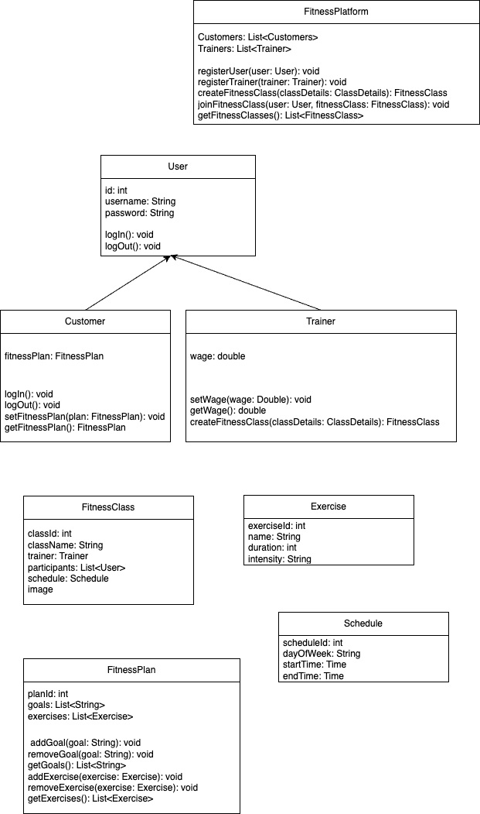

# Welcome to the course CSYE6200 - Object Oriented Design
> Northeastern University, College of Engineering

## Professor: Daniel Peters
## Project Name: FitFusion
Virtual Health and Fitness Platform

A comprehensive virtual health and fitness platform that brings together fitness enthusiasts, trainers, and health-conscious individuals in a dynamic and interactive online environment.
### UML

### Tech Stack
1. SpringBoot for Backend.
2. ReactJS App for frontend(nodeJS required).
3. MySQL for database.

### SetUp Instructions
1. Please clone the repository on your local system
2. Install and start mySQL server on your local machine and run all the scripts in backend/src
3. For IntelliJ you can just run a springBoot application.
4. For frontend just change directory, run npm i and run npm start

